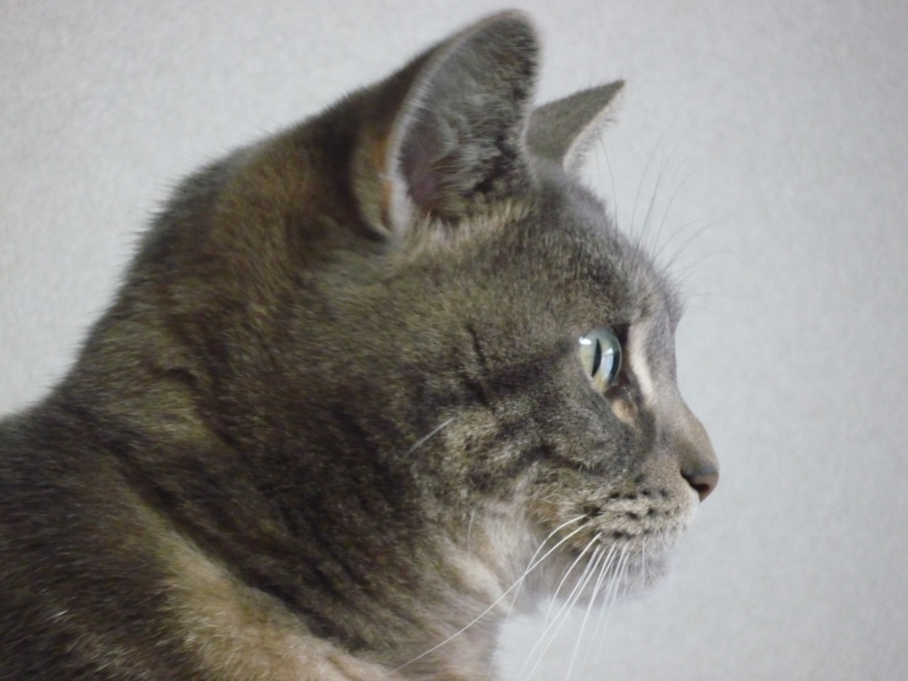

# Git Sample

こんにちは



## 見出し2

- アイテム1
- アイテム2
  - アイテム2-1

1. サンプル
2. サンプル２

リンク

このページのソースコードは[こちら](https://github.com/newgitbook/gitbook-sample)

```
#include <stdio.h>

int main() {
    printf("Hello World !!\n");
    return 0;
}
```

